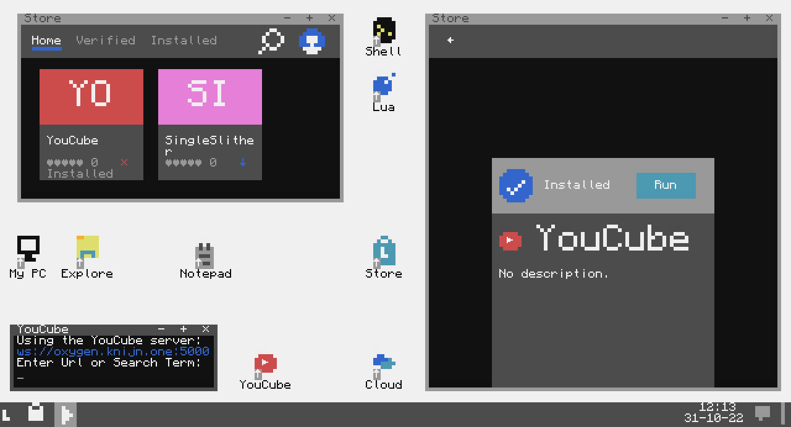
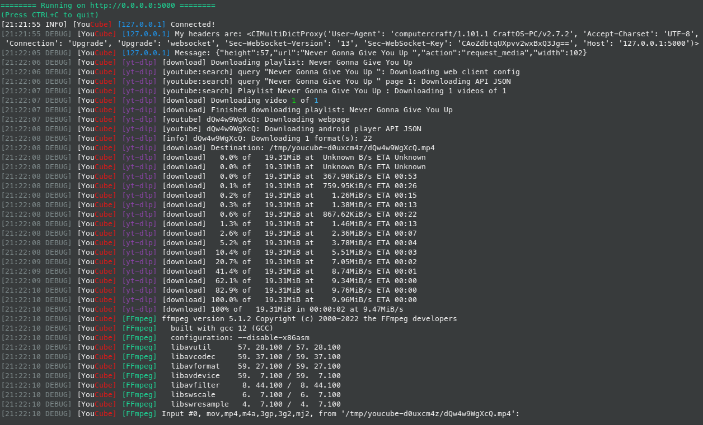

# YouCube

[](https://github.com/Commandcracker/YouCube/blob/main/LICENSE.txt)
[](https://github.com/tomodachi94/awesome-computercraft)

[](https://github.com/Commandcracker/YouCube/actions/workflows/spellcheck.yml)
[](https://github.com/Commandcracker/YouCube/actions/workflows/asyncapi-doc.yml)

YouCube streams media from services like YouTube to [ComputerCraft: Tweaked](https://github.com/cc-tweaked/CC-Tweaked). \
**Project Status: Proof of concept**

## Installation

### Client

[](https://tweaked.cc/)

[](https://tweaked.cc/)

[](https://wiki.vexatos.com/wiki:computronics)

[](https://github.com/Commandcracker/YouCube/actions/workflows/illuaminate-lint.yml)


The client can be installed by running the following command:

```shell
pastebin run swsmNAf7
```

or

```shell
wget run https://raw.githubusercontent.com/Commandcracker/YouCube/main/installer.lua
```

#### Starting the Client

```text
youcube
```

#### Libraries

All libraries that are used by the [client](https://github.com/Commandcracker/YouCube/blob/main/client/youcube.lua).

| Library                                                                                               |
|-------------------------------------------------------------------------------------------------------|
| [argparse](https://github.com/Commandcracker/cc-argparse)                                             |
| [numberformatter](https://github.com/Commandcracker/YouCube/blob/main/client/lib/numberformatter.lua) |
| [semver](https://github.com/kikito/semver.lua)                                                        |
| [youcubeapi](https://github.com/Commandcracker/YouCube/blob/main/client/lib/youcubeapi.lua)           |

#### UnicornPKG (Experimental)

YouCube can be installed with [unicornpkg](https://unicornpkg.madefor.cc/). \
Just install the Dependencies and then run `hoof install youcube`

##### Dependencies

- `hoof install numberformatter`
- `hoof install youcubeapi`
- `hoof install semver`
- `wget https://raw.githubusercontent.com/Commandcracker/YouCube/main/client/lib/argparse.lua /lib/argparse.lua`

#### LevelOS / lStore

[](https://github.com/Commandcracker/YouCube/actions/workflows/lstore-put.yml)

On [LevelOS](https://discord.com/invite/vBsjGqy99U) YouCube can be installed by running `lStore get YouCube <path>` or `lStore get bpBYV1aG <path>` or by Using the StoreUI.



#### Settings

Settings that can be set with the CC: Tweaked [settings module](https://tweaked.cc/module/settings.html#v:get)

| name             | default | Description                      |
|------------------|---------|----------------------------------|
| `youcube.server` |         | First server that should be used |

### Server

[](https://www.python.org/downloads/)
[](https://github.com/Commandcracker/YouCube/actions/workflows/pylint.yml)



YouCube has a some public servers, which you can use if you don't want to host your own server. \
The client has the public servers set by default, so you can just run the client, and you're good to go. \
Moor Information about the servers can be seen on the [doc](https://commandcracker.github.io/YouCube/).

#### Requirements

- [yt-dlp/FFmpeg](https://github.com/yt-dlp/FFmpeg-Builds) / [FFmpeg 5.1+](https://ffmpeg.org/)
- [sanjuuni](https://github.com/MCJack123/sanjuuni)
- [Python 3.7+](https://www.python.org/downloads/)
  - [aiohttp](https://pypi.org/project/aiohttp/)
  - [yt-dlp](https://pypi.org/project/yt-dlp/)

You can install the required packages with [pip](https://pip.pypa.io/en/stable/installation/) by running:

```shell
pip install -r server/requirements.txt
```

#### Starting the Server

```bash
python server/youcube.py
```

#### Environment variables

Environment variables you can use to configure the server.

| Variable          | Default    | Description                                 |
|-------------------|------------|---------------------------------------------|
| `PORT`            | `5000`     | The port where the web server should run on |
| `TRUSTED_PROXIES` |            | Trusted proxies (separated by comma`,`)     |
| `FFMPEG_PATH`     | `ffmpeg`   | Path to the FFmpeg executable               |
| `SANJUUNI_PATH`   | `sanjuuni` | Path to the Sanjuuni executable             |
| `NO_COLOR`        | `False`    | Disable colored output                      |
| `LOGLEVEL`        | `DEBUG`    | Python Log level of the main logger         |

### Docker Compose

```yml
version: "2.0"
services:
  youcube:
    image: ghcr.io/commandcracker/youcube:main
    restart: always
    hostname: youcube
    ports:
      - 5000:5000
```
